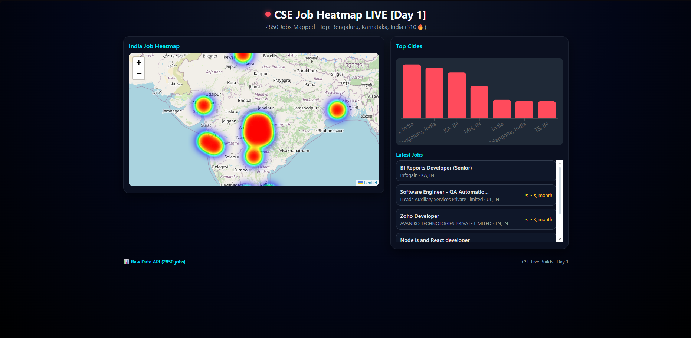

# CSE Job Heatmap

Interactive **India CSE job market heatmap**.  
Scrapes software jobs, enriches them with geo‑coordinates, stores them in MongoDB, and visualizes hotspots on a React + Leaflet map with **Top Cities** and **Latest Jobs**.[1][2]

***
## Showcase

https://job-heatmap.vercel.app

## Tech Stack

- **Scraper**: Python, `jobspy`, `pandas`, `pymongo`[3][4]
- **Database**: MongoDB (local)  
- **Backend API**: Node.js, Express, Mongoose[5][1]
- **Frontend**: React, `react-leaflet`, heatmap layer[6][7]

***

## Project Structure

```text
job-heatmap/
  scraper/
    scrapjobs.py           # Scrape raw jobs → CSV
    heatmap_geo.py         # Add geo + push to MongoDB
    scraped_jobs_cleaned.csv  # Generated
  backend/
    server.js              # Express API for jobs
    package.json
    .env.example
  frontend/
    src/
      App.js               # Heatmap + charts UI
      App.css
    package.json
  README.md
```

***

## 1. Prerequisites

- Node.js (v18+ recommended)[1]
- Python 3.10+  
- MongoDB Community Server running locally on `mongodb://localhost:27017`[2]

***

## 2. Clone the Repository

```bash
git clone https://github.com/<your-username>/job-heatmap.git
cd job-heatmap
```

***

## 3. Setup and Run Scraper (Python)

### 3.1 Create virtual environment

Using Conda:

```bash
conda create -n jobspy_env python=3.11 -y
conda activate jobspy_env
```

Install dependencies:

```bash
cd scraper
pip install jobspy pandas pymongo
```

### 3.2 Configure MongoDB connection

In `scraper/heatmap_geo.py`:

```python
from pymongo import MongoClient

client = MongoClient("mongodb://localhost:27017")
db = client.jobheatmap
collection = db.jobs
```

### 3.3 Run scraper pipeline

```bash
cd scraper

# 1) Scrape jobs from job portals → CSV
python scrapjobs.py

# 2) Clean + add geo + push to MongoDB
python heatmap_geo.py
```

After this:

- `scraped_jobs_cleaned.csv` is created.  
- Collection `jobheatmap.jobs` in MongoDB is filled with job documents.[4][3]

***

## 4. Setup and Run Backend (Node + Express)

### 4.1 Install dependencies

```bash
cd backend
npm install
```

Typical dependencies (in `package.json`):

- `express`
- `mongoose`
- `cors`
- `dotenv`
- `nodemon` (for dev)[5][1]

### 4.2 Environment variables

Create `backend/.env` from the example:

```bash
cp .env.example .env
```

Inside `.env`:

```env
MONGODB_URI=mongodb://localhost:27017/jobheatmap
PORT=5000
```

### 4.3 Start backend (development)

Use nodemon for auto‑reload:

```bash
cd backend
npm run dev
```

Or plain Node:

```bash
npm start
```

Backend will be available at:

- API base: `http://localhost:5000`
- Jobs endpoint: `http://localhost:5000/api/jobs`

You can test in browser/Postman; it should return a JSON array of jobs.[5][1]

***

## 5. Setup and Run Frontend (React)

### 5.1 Install dependencies

```bash
cd frontend
npm install
```

Packages used:

- `react`, `react-dom`
- `react-leaflet`, `leaflet`
- heatmap layer (e.g., `react-leaflet-heatmap-layer` or `leaflet.heat` wrapper)[8][6]
- `axios`
- `recharts` for Top Cities bar chart

### 5.2 Configure backend API URL

In `frontend/src/App.js`, make sure the API URL points to your local backend:

```javascript
useEffect(() => {
  axios
    .get('http://localhost:5000/api/jobs')
    .then((response) => {
      // setJobs, setTopCities, etc.
    })
    .catch((error) => {
      console.error('Error fetching jobs:', error);
    });
}, []);
```

### 5.3 Start frontend

```bash
cd frontend
npm start
```

Frontend will run at `http://localhost:3000`.

You should see:

- India map with heatmap of job density.  
- Top Cities chart (e.g., Bangalore, Pune, Noida).  
- Latest Jobs list with title, company, location, and salary.

***

## 6. Local Development Workflow

From root:

```bash
# 1. Start MongoDB (in another terminal)
mongod

# 2. Activate Python env and refresh data
conda activate jobspy_env
cd scraper
python scrapjobs.py
python heatmap_geo.py

# 3. Start backend
cd ../backend
npm run dev

# 4. Start frontend
cd ../frontend
npm start
```

Open `http://localhost:3000` in the browser.

***

## 7. Useful NPM & Python Commands

### Backend

```bash
cd backend
npm install      # install dependencies
npm run dev      # start dev server with nodemon
npm start        # start production server
```

### Frontend

```bash
cd frontend
npm install      # install dependencies
npm start        # run React dev server
npm run build    # production build
```

### Scraper

```bash
cd scraper
conda activate jobspy_env
python scrapjobs.py    # scrape jobs
python heatmap_geo.py  # clean + geo + push to MongoDB
```

***

## 8. Future Enhancements

- Filters: role, tech stack, experience, salary range.  
- Pagination or infinite scroll for jobs list.  
- City comparison view (Delhi vs Bangalore vs Pune).  
- Automatic cron-based scraping using a small VPS.[9][3]
